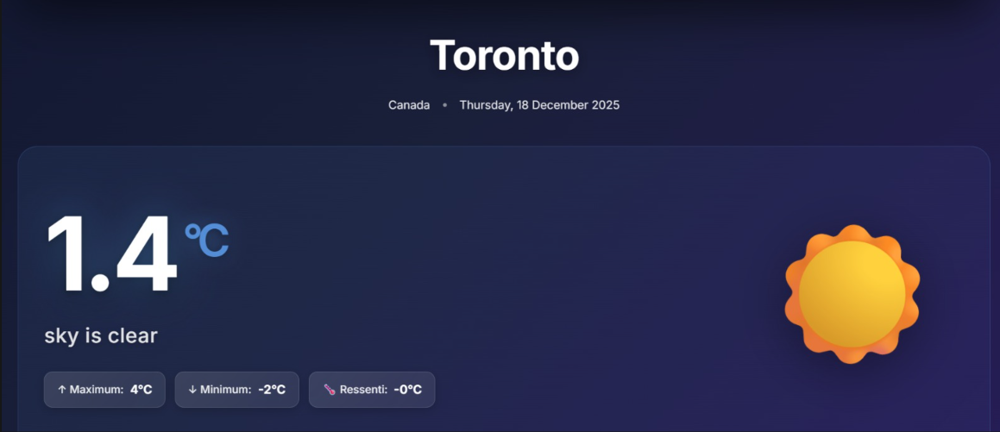
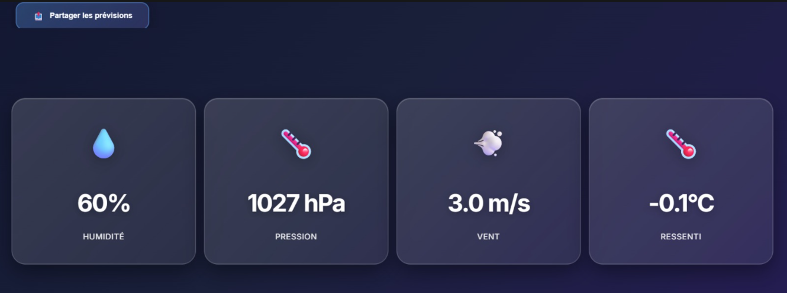
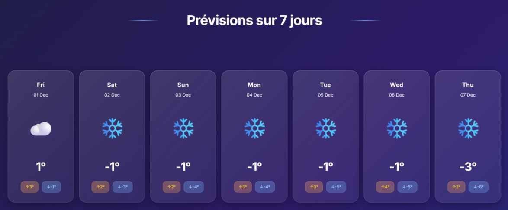
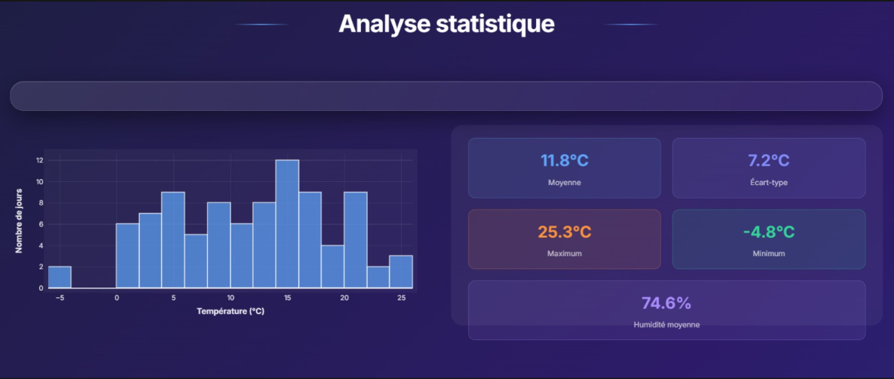

🌦️ SYWeather – Prévisions Météorologiques Intelligentes

SYWeather est une application web interactive développée avec Streamlit, dédiée à la prévision météorologique intelligente.
Elle exploite des techniques d’intelligence artificielle et de machine learning afin d’analyser des données météorologiques historiques et de générer des prévisions fiables et interprétables.

L’application permet aux utilisateurs de consulter en temps réel les conditions météorologiques actuelles, d’explorer les tendances climatiques, et d’accéder à des visualisations claires pour différentes villes à travers une interface moderne et intuitive.

🚀 Fonctionnalités principales

 . Sélection de villes

 . Affichage de la température actuelle

 . Visualisation des données météorologiques

 . Prévisions basées sur l’IA et le Machine Learning

 . Interface moderne et intuitive

🛠️ Technologies utilisées

 . Python : langage principal pour le traitement des données et le développement de l’application.

 . Streamlit : framework utilisé pour créer une application web interactive et rapide à déployer.

 . Pandas : bibliothèque dédiée à la manipulation et à l’analyse des données météorologiques.

 . Plotly : outil de visualisation interactive pour la création de graphiques dynamiques.

 . Matplotlib : utilisé pour certaines visualisations statistiques et graphiques complémentaires.

 . Machine Learning : techniques d’apprentissage automatique appliquées à la modélisation et à la prédiction des données climatiques.

👩‍💻 Auteurs

Ce projet a été développé par Yasmine & Samia dans le cadre d’un projet universitaire.

